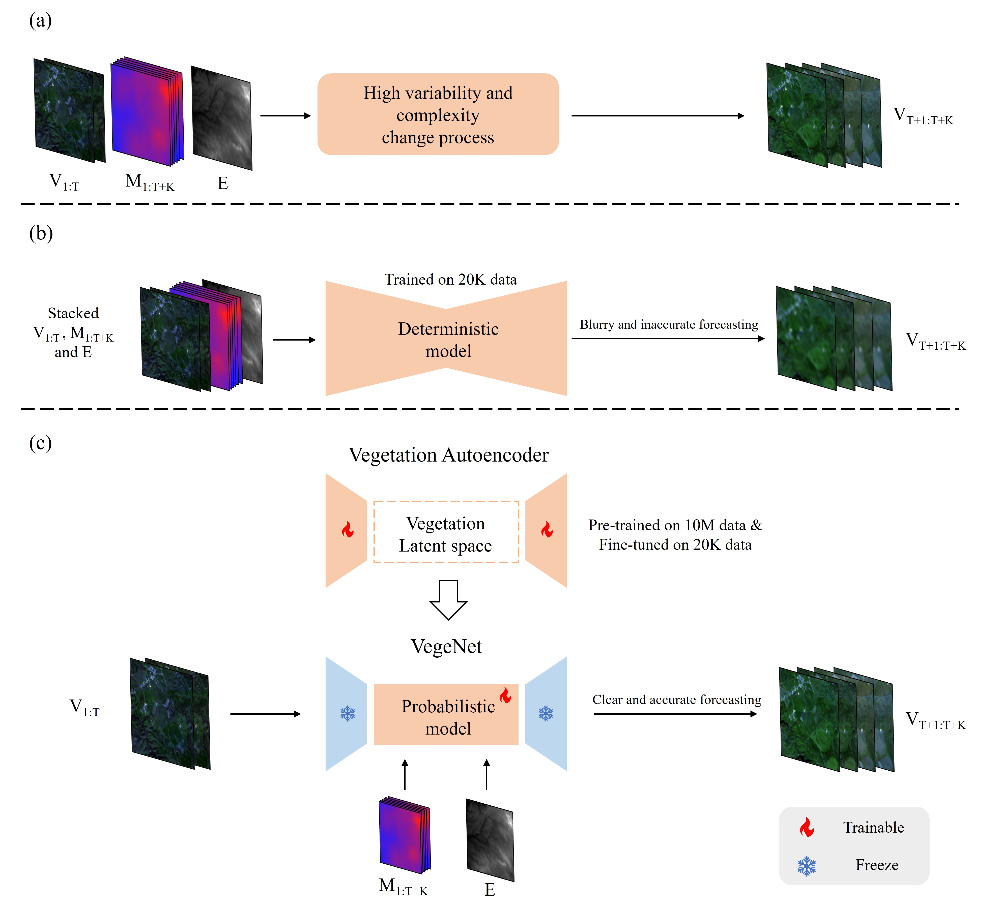

<div align="center">
    <h2>
        VegeDiff: Latent Diffusion Model for Geospatial Vegetation Forecasting
    </h2>
</div>
<br>

<div align="center">
  
</div>
<br>
<div align="center">
  <!-- <a href="https://kychen.me/RSMamba">
    <span style="font-size: 20px; ">项目主页</span>
  </a>
       -->
  <a href="https://arxiv.org/abs/2407.12592">
    <span style="font-size: 20px; ">arXiv</span>
  </a>
      
  <a href="resources/VegeDiff.pdf">
    <span style="font-size: 20px; ">PDF</span>
  </a>
  <!--     
  <a href="https://huggingface.co/spaces/KyanChen/RSMamba">
    <span style="font-size: 20px; ">HFSpace</span>
  </a> -->
</div>
<br>
<br>

[](https://github.com/walking-shadow/Official_VegeDiff)
[](LICENSE)
[](https://arxiv.org/abs/2407.12592)

<!-- [](https://huggingface.co/spaces/KyanChen/RSMamba) -->

<!-- <br>
<br> -->

<!-- <div align="center">

English | [简体中文](README_Chinese.md)

</div> -->

## Introduction

The repository for this project is the code implementation of the paper [VegeDiff: Latent Diffusion Model for Geospatial Vegetation Forecasting](https://arxiv.org/abs/2407.12592).

If you find this project helpful, please give us a star ⭐️.

<details open>
<summary>Main Contribution</summary>

- A probabilistic model is firstly introduced into the geospatial vegetation forecasting task. VegeDiff employs the diffusion process to model the uncertainties in the vegetation change process, capturing multiple potential futures of geospatial vegetation states and generating clear and accurate forecasting results.

- A vegetation autoencoder is designed to achieve a robust representation of geospatial vegetation states. This vegetation autoencoder was pre-trained on 10M RGBN remote sensing data and fine-tuned on 20K remote sensing vegetation data, enabling its latent space to effectively represent the geospatial vegetation states.

- VegeNet is designed to model the impact of static environmental and dynamic meteorological variables on geospatial vegetation changes. VegeNet decouples the effects of static environmental variables and dynamic meteorological variables on the geospatial vegetation change process, effectively modeling the transformation process of vegetation under the influence of these variables.

</details>


## Citation

If you are using this project's code or performance benchmarks in your research, please refer to bibtex to reference VegeDiff below.

```
@article{zhao2025vegediff,
  title={VegeDiff: Latent Diffusion Model for Geospatial Vegetation Forecasting},
  author={Zhao, Sijie and Chen, Hao and Zhang, Xueliang and Xiao, Pengfeng and Bai, Lei},
  journal={IEEE Transactions on Geoscience and Remote Sensing},
  year={2025},
  publisher={IEEE}
}
```

## License

This project is licensed under the [Apache 2.0 License](LICENSE)。
